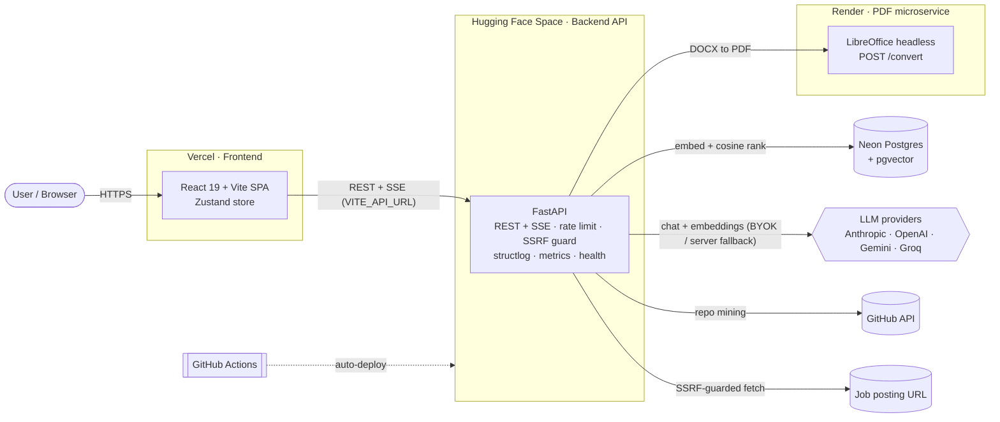
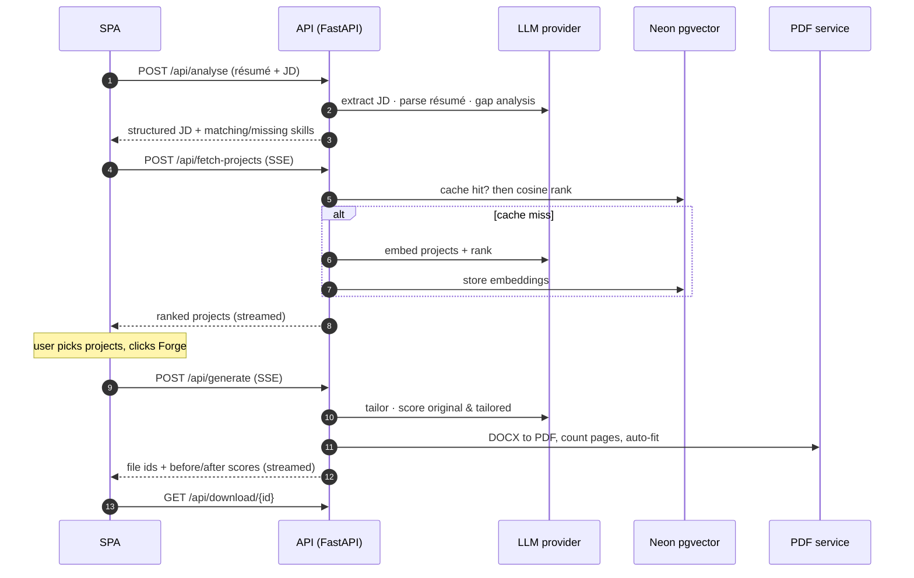
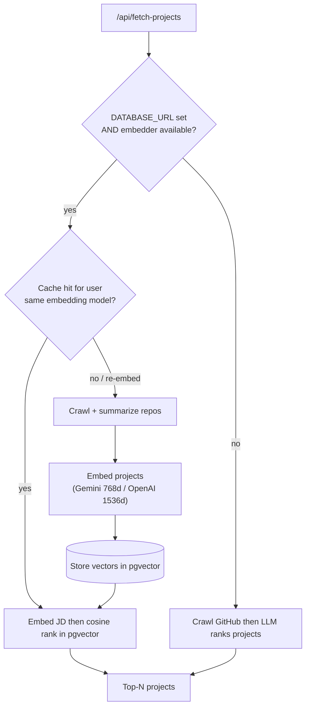

<div align="center">

# 🔥 ResumeForge

**Forge a résumé the job can't ignore — AI résumé tailoring with a true one-page guarantee.**

[](https://github.com/shiva-shivanibokka/ResumeForge/actions/workflows/ci.yml)
[](./LICENSE)


### ▶︎ [Live demo](https://resume-forge-eight-olive.vercel.app/)

</div>

---

## 🧭 Recruiter TL;DR

- **What it is:** a full-stack web app that ingests a job description, your résumé, and your GitHub, then produces a **tailored, ATS-scored, genuinely one-page résumé and cover letter** — with a bring-your-own-key model picker (Anthropic, OpenAI, Gemini, Groq).
- **Hardest problem solved:** a **true one-page auto-fit** — the backend renders the document to PDF, counts the actual pages, and binary-searches the font size down until it really fits, instead of trusting a heuristic and silently spilling onto page 2. Built on a **multi-provider LLM + RAG pipeline** (Postgres/pgvector) running entirely on **free-tier cloud infra** across three providers.
- **Engineering breadth:** REST + SSE API, async/threadpool concurrency, SSRF guard + per-IP rate limiting, structured logging + health checks, a Dockerized PDF microservice, CI (lint + 65 automated tests + build), and auto-deploy to Hugging Face Spaces / Render / Vercel.

---

## Overview — the problem

Tailoring a résumé to each job is slow and repetitive: you re-read the posting, hunt for the keywords it wants, pick which projects to feature, rewrite bullets, re-check it still fits one page, and then write a matching cover letter. People either skip it (and get filtered by ATS keyword scans) or burn 30+ minutes per application.

**ResumeForge** turns that into a single guided pass. You bring a job posting (URL or pasted text), your résumé (PDF/DOCX), and optionally your GitHub username. It:

1. Parses the JD and your résumé, and runs a **skills gap analysis** (what already matches vs. what's missing).
2. Mines and ranks your **GitHub projects** against the role.
3. **Tailors** the résumé — selected projects, JD-aligned skills, lightly rewritten bullets — and **scores** it (ATS readiness + JD match) *before and after*, so the improvement is visible.
4. Guarantees a **one-page layout** and exports **DOCX + PDF**.
5. Generates a matching **cover letter**.

It's **bring-your-own-key (BYOK)**: pick an engine and paste your own API key in the UI (Gemini and Groq have generous free tiers), or run it with an optional server-side key.

> Built as a portfolio / interview project — the goal was a small product that exercises real production concerns (streaming, concurrency, security, multi-cloud deployment, tests), not a notebook demo.

---

## ✨ Features

- **Multi-provider LLM, BYOK** — Anthropic, OpenAI, Google Gemini, and Groq, each with a model picker tagged free/paid. Keys are supplied per-request from the UI; an optional server key is a fallback.
- **JD ingestion** — fetch from a posting URL (behind an **SSRF guard** that re-validates every redirect hop) or paste the raw text.
- **Résumé parsing** — PDF (PyMuPDF / pdfminer) and DOCX, with contact/skills/experience extraction.
- **GitHub project mining** — crawls your most recent repos (README, dependency manifests, metadata) and has an LLM rank them for the specific role.
- **RAG embedding cache** — when a Postgres/pgvector database is configured, projects are embedded **once** and reused via cosine similarity; embeddings follow your chosen engine (Gemini `text-embedding-004` 768-dim or OpenAI `text-embedding-3-small` 1536-dim). Without a DB it transparently falls back to LLM ranking.
- **Skills gap UX** — shows the JD skills you already match **and** the ones you're missing; click a missing keyword to insert it into your résumé (no extra LLM call).
- **True one-page auto-fit** — renders to PDF, counts pages, and shrinks the font proportionally until it genuinely fits one page; it never cuts content. A manual font-size override is also available.
- **Before / after scoring** — scores your *original* résumé and the *tailored* one against the JD and shows the lift (ATS readiness + JD match), with improvement tips under each.
- **Two rebuild paths** — instant **format** rebuild (font/size/length, no LLM) vs. **AI refine** (content edits).
- **Cover letter** — generation with tone control, plus AI revision.
- **Streaming progress** — long operations (crawl, generate) stream step-by-step progress over **Server-Sent Events**.
- **Production hardening** — per-IP rate limiting on expensive endpoints, structured JSON logging (structlog), in-process request metrics, `/api/health`, an ephemeral TTL file store for downloads, and graceful degradation when the DB or PDF service is unavailable.

---

## 🏗️ Architecture

ResumeForge is split into three independently deployed pieces plus stateless external services. The split is deliberate:

- **The SPA is separate from the API** so the frontend can deploy to a static/edge host (Vercel) and the API can scale and be hardened on its own. ([ADR 0001](docs/adr/0001-spa-fastapi-split.md))
- **The API runs on Hugging Face Spaces (16 GB RAM free)** rather than the original Render box — the LLM SDKs plus document tooling pushed memory past Render's 512 MB free limit and got OOM-killed.
- **PDF conversion is its own microservice** — LibreOffice headless spikes ~300–400 MB during a conversion, so it lives in its own container instead of bloating (and crashing) the API. ([ADR 0006](docs/adr/0006-pdf-converter-microservice.md))
- **The RAG cache is optional** — a Neon Postgres + pgvector store makes repeat runs fast, but the app is fully functional without it. ([ADR 0005](docs/adr/0005-rag-embedding-cache.md))

### System topology



### The "forge" pipeline (streamed)



### RAG project-ranking decision flow



**Concurrency model:** FastAPI's event loop must never block. Streaming endpoints (`/generate`, `/fetch-projects`) run their blocking work (LLM calls, GitHub crawl, PDF render) in a worker **thread** and bridge progress onto an async SSE generator. The remaining blocking handlers are plain `def` (or use `run_in_threadpool`), so FastAPI runs them in its threadpool instead of stalling the loop.

---

## 🧰 Tech stack

| Layer | Choice | Why |
|---|---|---|
| Backend | **FastAPI** (Python 3.11), Uvicorn | First-class async + SSE, typed requests, runs sync handlers in a threadpool |
| LLM | **Anthropic / OpenAI / Gemini / Groq** SDKs behind a provider abstraction | BYOK + free-tier options; one interface, lazily-imported SDKs |
| Embeddings / RAG | **Neon Postgres + pgvector** | Cache GitHub-project vectors; cosine search via `<=>`; dimension-agnostic column so two embedding models coexist |
| Documents | **python-docx**, **PyMuPDF** / **pdfminer.six**, **LibreOffice** (headless) | Build DOCX, parse PDF/DOCX, convert DOCX to PDF on Linux without MS Word ([ADR 0003](docs/adr/0003-libreoffice-pdf.md)) |
| Config / logging | **pydantic-settings**, **structlog** | Fail-loud typed config at startup; structured JSON logs |
| Frontend | **React 19 + TypeScript (strict)**, **Vite 6**, **Tailwind v4**, **Zustand**, **Motion** | Fast SPA, small global store, native-rendered streaming UI |
| Infra | **Docker**, **GitHub Actions**, **Hugging Face Spaces**, **Render**, **Vercel** | Free-tier multi-cloud; CI on every push; auto-deploy |

Exact versions live in [`backend/requirements.txt`](backend/requirements.txt) / [`backend/pyproject.toml`](backend/pyproject.toml) and [`frontend/package.json`](frontend/package.json).

---

## 🎯 Skills demonstrated

- **LLM application development, RAG, multi-provider abstraction** — provider strategy pattern, embedding cache with pgvector, prompt design for JD/résumé tasks.
- **RESTful + streaming API design** — typed FastAPI routes with Server-Sent Events for long-running work.
- **Asynchronous / concurrent systems design** — event-loop-safe handlers, threadpool offloading, threaded SSE workers.
- **System design & architecture** — service split with documented tradeoffs ([ADRs](docs/adr/)).
- **Application security** — SSRF guard with per-redirect revalidation, per-IP rate limiting, input/upload validation, CORS hardening.
- **Cloud deployment (Hugging Face Spaces, Render, Vercel)** — three free-tier providers, auto-deploy via GitHub Actions.
- **CI/CD & automated testing** — GitHub Actions running lint, a backend test suite with coverage, and a frontend build.
- **Observability & monitoring** — structured logging, in-process metrics, health endpoints.
- **Containerization & Docker** — multi-service Docker setup, non-root images, healthchecks.
- **Database design & migration** — pgvector schema with an in-code column-type migration and graceful-degrade read paths.

---

## 🚀 Getting started (from scratch)

### Prerequisites

| Tool | Version | Notes |
|---|---|---|
| Python | 3.11+ | backend |
| Node.js | 20+ | frontend |
| An LLM API key | — | **Gemini** ([aistudio.google.com](https://aistudio.google.com/app/apikey)) or **Groq** ([console.groq.com](https://console.groq.com)) are free |
| LibreOffice | optional | only for **local** PDF export (`libreoffice-writer`); without it you still get DOCX |
| Postgres + pgvector | optional | only for the RAG cache (e.g. a free [Neon](https://neon.tech) database) |

```bash
git clone https://github.com/shiva-shivanibokka/ResumeForge.git
cd ResumeForge
```

### 1) Backend (FastAPI)

```bash
cd backend
python -m venv .venv
# Windows:  .venv\Scripts\activate     macOS/Linux:  source .venv/bin/activate
pip install -r requirements.txt

cp .env.example .env          # all values have safe defaults; keys are optional
uvicorn app.main:app --reload --port 8000
```

Verify it's up:

```bash
curl http://localhost:8000/api/health      # {"status":"ok","service":"ResumeForge API"}
curl http://localhost:8000/api/providers   # the engine/model catalog
```

### 2) Frontend (Vite + React)

```bash
cd frontend
npm install
npm run dev        # http://localhost:5173
```

In dev you **don't** need to configure anything: Vite proxies `/api` to `http://localhost:8000` automatically (see [`vite.config.ts`](frontend/vite.config.ts)). Open `http://localhost:5173`, pick an engine, paste your API key, and run a résumé through.

### 3) (Optional) Local PDF export

Install LibreOffice headless so DOCX to PDF works locally:

```bash
# Debian/Ubuntu
sudo apt-get install -y libreoffice-writer
# macOS:  brew install --cask libreoffice    Windows: install LibreOffice
```

Alternatively, run the bundled converter microservice and point the API at it via `PDF_SERVICE_URL` (see [`pdf-service/`](pdf-service/)).

### 4) (Optional) RAG embedding cache

Create a Postgres database with the `pgvector` extension (Neon enables it with one click), then set in `backend/.env`:

```
DATABASE_URL=postgresql://...        # enables the embedding cache
GOOGLE_API_KEY=...                   # Gemini embeddings (used when the chat engine is Gemini, or as the server fallback)
```

The table and extension are created automatically on first startup. Without `DATABASE_URL`, project ranking falls back to the LLM and everything still works.

---

## ⚙️ Configuration

All backend settings have safe defaults — see [`backend/.env.example`](backend/.env.example). The ones you'll most likely set:

| Variable | Default | Purpose |
|---|---|---|
| `ENVIRONMENT` | `dev` | `dev` or `prod` |
| `ALLOWED_ORIGINS` | `http://localhost:5173` | comma-separated allowed frontend origins |
| `ANTHROPIC_/OPENAI_/GOOGLE_/GROQ_API_KEY` | _(unset)_ | optional server-side keys (users can also bring their own per-request) |
| `GITHUB_TOKEN` | _(unset)_ | raises the GitHub API rate limit (60 to 5000 req/hr) |
| `DATABASE_URL` | _(unset)_ | Postgres/pgvector connection string for the RAG cache |
| `PDF_SERVICE_URL` | _(unset)_ | URL of the DOCX to PDF converter; falls back to local LibreOffice |
| `MAX_UPLOAD_MB` | `10` | résumé upload size cap |
| `RATE_LIMIT_MAX` | `30` | per-IP requests/window on expensive endpoints (`0` disables) |

**Frontend:** in production set `VITE_API_URL` to the deployed API URL (e.g. on Vercel). In dev it's unset and the proxy handles it.

---

## 🔌 Usage

### In the app

The UI is a four-step flow: **Materials** (engine + key, JD, résumé, GitHub) → **Heat** (matching/missing skills, pick projects) → **Forge** (tailored résumé, before/after scores, DOCX/PDF) → **Temper** (cover letter).

### API surface

| Method | Endpoint | Purpose |
|---|---|---|
| `GET` | `/api/health` | liveness |
| `GET` | `/api/providers` | engine/model catalog |
| `GET` | `/api/metrics` | in-process request metrics |
| `POST` | `/api/analyse` | parse JD + résumé, return structured JD + gap analysis |
| `POST` | `/api/fetch-projects` | rank GitHub projects for the JD *(SSE)* |
| `POST` | `/api/generate` | full tailor + build + score pipeline *(SSE)* |
| `POST` | `/api/edit-resume` | AI content edit + rebuild + rescore |
| `POST` | `/api/rebuild-resume` | re-render with new font/size or inserted skills *(no LLM)* |
| `POST` | `/api/cover-letter` / `/api/edit-cover-letter` | generate / revise cover letter |
| `GET` | `/api/projects/cache` | whether a user's embeddings are cached |
| `GET` | `/api/download/{file_id}` | download a generated DOCX/PDF |

Example:

```bash
curl -s http://localhost:8000/api/providers | python -m json.tool
```

Streaming endpoints emit `data: {...}` SSE frames: `{"type":"progress","message":...}` while working, then a terminal `{"type":"done", ...}` (or `{"type":"error", ...}`).

---

## 🗂️ Project structure

```
ResumeForge/
├── backend/                  FastAPI service
│   └── app/
│       ├── main.py           app factory: CORS, rate-limit + observability middleware, lifespan
│       ├── config.py         typed pydantic-settings (fail-loud at startup)
│       ├── security.py       SSRF guard + upload validation
│       ├── ratelimit.py      per-IP in-process rate limiter
│       ├── sse.py            threaded-work to Server-Sent Events bridge
│       ├── store.py          ephemeral TTL file store for downloads
│       ├── db.py             Postgres + pgvector (pooled, inert without DATABASE_URL)
│       ├── embeddings.py     provider-aware embeddings (Gemini / OpenAI)
│       ├── metrics.py        in-process request metrics
│       ├── llm/              provider abstraction (anthropic/openai/gemini/groq) + registry
│       ├── routers/          analyse · projects · generate · cover_letter · files · meta
│       └── services/         jd_parser · resume_parser · github_parser · project_matcher ·
│                             rag · resume_builder · cover_letter · scorer · pdf
│   └── tests/                pytest suite (65 tests)
├── frontend/                 Vite + React 19 + TS SPA
│   └── src/
│       ├── App.tsx           layout, header, step routing
│       ├── store.ts          Zustand store (all app state + API actions)
│       ├── lib/              api client (REST + SSE), types, provider catalog
│       ├── components/       UI primitives, gauges, progress log, provider picker
│       └── features/         Materials · Projects (Heat) · Forge · CoverLetter (Temper) · Stepper
├── pdf-service/              minimal FastAPI + LibreOffice DOCX to PDF microservice
├── docs/adr/                 architecture decision records (0001-0006)
├── .github/workflows/        ci.yml · deploy-hf-space.yml · keepalive.yml
├── render.yaml               Render blueprint (PDF converter)
└── docker-compose.yml        local multi-service bring-up
```

---

## 🧪 Testing

```bash
cd backend
pytest                      # 65 tests
ruff check app tests        # lint
pytest --cov=app            # coverage (term-missing)

cd ../frontend
npm run build               # tsc --noEmit + production build (type-checks the SPA)
```

[CI](.github/workflows/ci.yml) runs on every push and PR: the backend job installs LibreOffice (so the PDF-conversion test actually runs), lints with ruff, and runs `pytest` **with coverage**; the frontend job runs the typechecked build. Coverage is reported in CI (`term-missing`); no specific percentage is claimed here.

---

## ☁️ Deployment

Three free-tier hosts, auto-deployed:

| Piece | Host | How |
|---|---|---|
| **Frontend** | Vercel — [resume-forge-eight-olive.vercel.app](https://resume-forge-eight-olive.vercel.app/) | `VITE_API_URL` set to the API URL; redeploy on push |
| **API** | Hugging Face Space (Docker, 16 GB free) — `shiva-1993-resumeforge-api.hf.space` | [`deploy-hf-space.yml`](.github/workflows/deploy-hf-space.yml) syncs `backend/` to the Space on every push to `main` |
| **PDF converter** | Render (Docker) — `resumeforgepdf.onrender.com` | [`render.yaml`](render.yaml) blueprint |

Free tiers spin down on idle, so [`keepalive.yml`](.github/workflows/keepalive.yml) pings the API and converter health endpoints every ~10 minutes (a scheduled cron is best-effort — pair it with an external monitor like UptimeRobot for production-grade uptime).

A [`docker-compose.yml`](docker-compose.yml) brings the services up together for local end-to-end testing.

---

## 📈 Impact

This is a working portfolio project, not a load-tested production service, so the points below are qualitative and honest — no fabricated benchmarks:

- Replaces a manual, multi-step per-application workflow (re-read JD → find keywords → pick projects → rewrite → re-check page length → write cover letter) with a single guided, streamed pass.
- Makes the value **visible and defensible**: it scores the original résumé and the tailored one against the JD and shows the before→after lift, rather than asking the user to take the tailoring on faith.
- The **one-page guarantee is verified, not assumed** — the document is rendered to PDF and the real page count drives the font auto-fit, which is the part most résumé tools get subtly wrong.

> If you fork this for your own portfolio: the honest, interview-defensible move is to add your own measured numbers here (e.g. median generate latency from `/api/metrics`, or a small before/after ATS-score study) rather than inventing them.

---

## 🗺️ Roadmap / known limitations

- **One-click demo mode** — prefilled sample JD/résumé + a rate-limited server key so a recruiter can try it with zero setup.
- **SSE cancellation** — the streaming queue is bounded, but a client disconnect doesn't yet abort an in-flight LLM/crawl (the worker runs to completion). Proper cancellation needs cooperative checks in the worker.
- **Single-worker file store** — generated-file download IDs live in one process; scaling to multiple workers would need shared storage (object store / signed URLs).
- **GitHub crawl is capped at 30 most-recent repos** to stay within rate limits; very large profiles won't be fully mined.
- **Before/after scoring costs an extra LLM call** per generate (scoring the original résumé) — worth it for the visible lift, but a knob worth exposing.

---

## 📄 License

[MIT](./LICENSE) © 2026 Shivani Bokka.
